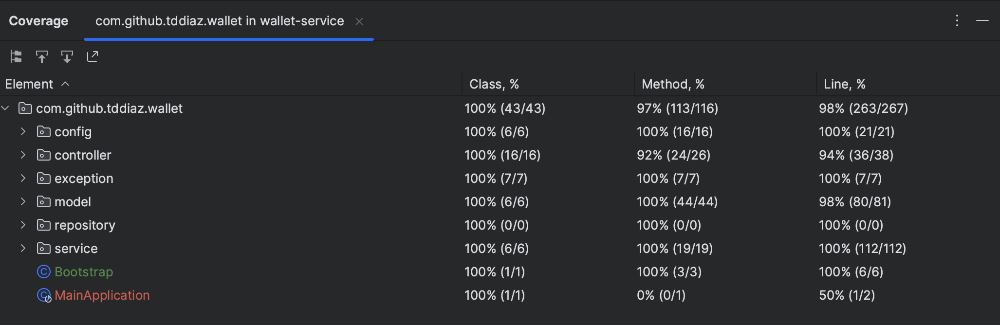
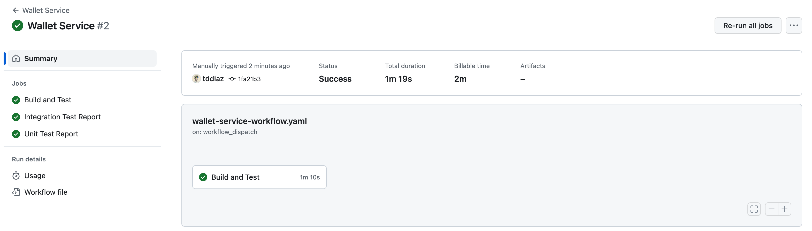

[](https://github.com/tddiaz/hubpay-task/actions/workflows/wallet-service-workflow.yaml)

# Added Assumptions
1. Deposit and withdrawing of funds via a Bank Transfer.
2. A callback API is provided for the custody bank (where the customer funds are held) to call and notify the status of the deposit/withdrawal requests whether it's a success or fail. For the purpose of testing, the callback API should be called manually to complete the flow.
3. Reversal notification from the bank is out of scope.
4. Added an `on-hold-balance` for the wallet when a withdrawal request is pending and will be reset in case of successful status from callback, else will be deposited back when settling the transaction.
5. A wallet can only support one currency.
6. The only supported currency is GBP.
7. Additional currency to be supported can be added via configuration.
8. Deposit and Withdrawal limits are configurable.

# Technologies Used
- Java 17
- Spring Boot
- Maven
- Hibernate
- Flyway - DB Migration Library
- Postgres DB
- Docker
- [TSID Creator](https://github.com/f4b6a3/tsid-creator) - for generating unique identifiers
- [Spring Boot Error Handling Library](https://wimdeblauwe.github.io/error-handling-spring-boot-starter/4.1.0/) - autoconfigures controller advice and standardize error response body.
- RestAssured - for API tests
- TestContainers - embedded Postgres DB for integration test
- Github Actions - for CI/CD

# Run and Build

## Build the Project
This command will build the `wallet-service` without running the test
```
make build
```

With tests (Unit and Integration Tests)
```
make build-with-tests
```
*Note*: The tests includes integration tests running with embedded PostgresDB using container, so make sure docker is running.

### Test Container Issues
In Mac OS, If you encounter an error saying 'docker environment is not available' even though docker is running,
execute this command
```
sudo ln -s $HOME/.docker/run/docker.sock /var/run/docker.sock
```
In case you are running in different OS. see [https://www.testcontainers.org/supported_docker_environment/](https://www.testcontainers.org/supported_docker_environment/)

## Run the Project
### Run in IntelliJ

1. Setup your local DB
- Run local DB

*Note*: Make sure your docker is running before executing the command.
```
make run-local-db
```
- To stop
```
make stop-local-db
```
- Connect to DB


2. Start `Application.java` in `wallet-service` module

### Run with Docker
1. Build the wallet-service docker image

*Note*: Make sure your docker is running before executing the command.
```
make build-image
```

verify that the `wallet-service` image is created, run:
```
docker images
```

2. Run docker compose

 - Run the wallet-service and postgresDB as containers
```
make run-app
```

 - To stop
```
make stop-app
```

# Implementation Details

## High Level Flow

### Deposit

### Withdraw

## Idempotency
A `referenceId` field is provided for deposit/withdrawal API request. The `referenceId` value is assumed as the reference number returned from the bank transfer integration.

If an existing transaction in DB has the same `referenceId` from the deposit/withdraw request, the request will be ignored and the API will return the existing details of the transaction.

## Concurrency Handling

To achieve concurrent update of the wallet balance, a DB row lock is implemented using pessimistic write lock.

```
    @Lock(LockModeType.PESSIMISTIC_WRITE)
    @Query("SELECT w FROM Wallet w WHERE w.id = :id AND w.customerId = :customerId")
    Optional<Wallet> findByIdAndCustomerIdWithExclusiveLock(@Param("id") Long walletId, @Param("customerId") Long customerId);
```

## Database DDL
```
CREATE TABLE wallet
(
    id                    BIGINT                      NOT NULL,
    customer_id           BIGINT                      NOT NULL,
    balance_currency      VARCHAR(3)                  NOT NULL,
    balance_amount        DECIMAL(19, 4)              NOT NULL,
    balance_held_currency VARCHAR(3)                  NOT NULL,
    balance_held_amount   DECIMAL(19, 4)              NOT NULL,
    created_at            TIMESTAMP WITHOUT TIME ZONE NOT NULL,
    PRIMARY KEY (id),
    CONSTRAINT uq_wallet_id_customer_id UNIQUE (id, customer_id)
);


CREATE TABLE transaction
(
    id                   BIGINT                      NOT NULL,
    reference_id         VARCHAR                     NOT NULL,
    wallet_id            BIGINT                      NOT NULL,
    transaction_currency VARCHAR(3)                  NOT NULL,
    transaction_amount   DECIMAL(19, 4)              NOT NULL,
    status               VARCHAR(10)                 NOT NULL,
    transaction_type     VARCHAR(20)                 NOT NULL,
    entry                VARCHAR(10)                 NOT NULL,
    created_at           TIMESTAMP WITHOUT TIME ZONE NOT NULL,
    PRIMARY KEY (id),
    CONSTRAINT fk_transaction_wallet_id FOREIGN KEY (wallet_id) REFERENCES wallet (id),
    CONSTRAINT uq_transaction_reference_id UNIQUE (reference_id)
);
```

## APIs
Postman collections is provided for import. Locate the file under `.postman` folder.

### Wallet API

#### Deposit Order
##### Endpoint
```
POST http://localhost:8080/api/v1/wallet/deposit
```
##### Sample Request
```
{
    "walletId": 434620675409151281,
    "customerId": 434620675409151280,
    "referenceId": "961D9DDEC075",
    "amount": {
        "currency": "GBP",
        "value": 10
    }
}
```
##### Sample Response
Success
```
{
    "transactionId": 434620754429837743,
    "status": "PENDING"
}
```

Failure
```
{
    "code": "AMOUNT_NOT_WITHIN_LIMIT",
    "message": "Invalid deposit amount. Max limit is '10000' and Min limit is '10'"
}
```


#### Withdraw Order
##### Endpoint
```
POST http://localhost:8080/api/v1/wallet/withdraw
```
##### Sample Request
```
{
    "walletId": 434620675409151281,
    "customerId": 434620675409151280,
    "referenceId": "961D9DDEC075",
    "amount": {
        "currency": "GBP",
        "value": 10
    }
}
```
##### Sample Response
Success
```
{
    "transactionId": 434636175504944618,
    "status": "PENDING"
}
```

Failure
```
{
    "code": "INSUFFICIENT_FUNDS",
    "message": "Not enough fundsToWithdraw. Remaining balance is only GBP 0.0000"
}
```

#### Wallet Details
##### Endpoint
```
GET http://localhost:8080/api/v1/wallet/{walletId}/customer/{customerId}
```

##### Sample Response
Success
```
{
    "walletId": 434632783470633724,
    "customerId": 434632783470633723,
    "totalBalance": {
        "currency": "GBP",
        "value": 10.0000
    },
    "amountOnHold": {
        "currency": "GBP",
        "value": 0.0000
    }
}
```

Failure
```
{
    "code": "NOT_FOUND",
    "message": "Wallet not found"
}
```

### Transaction API
#### Get Transactions
Default implementations:
- Transactions are sorted by `createAd` in DESC order
- `pageNumber` default value is `0`
- `size` default value is `10`

##### Endpoint
```
http://localhost:8080/api/v1/transactions/all?walletId={walletId}&customerId={customerId}&pageNumber={pageNumber}&size={size}
```
##### Sample Response
Success
```
{
    "totalCount": 2,
    "totalPages": 1,
    "pageNumber": 0,
    "numberOfElements": 2,
    "data": [
        {
            "id": 434636175504944618,
            "referenceId": "961D9DDEC12275",
            "type": "BANK_TRANSFER",
            "entry": "WITHDRAW",
            "status": "PENDING",
            "createdAt": "2023-04-14T12:48:59.390617",
            "amount": {
                "currency": "GBP",
                "value": 10.0000
            }
        },
        {
            "id": 434635242272303833,
            "referenceId": "961D9DDEC1275",
            "type": "BANK_TRANSFER",
            "entry": "DEPOSIT",
            "status": "SUCCESS",
            "createdAt": "2023-04-14T12:45:16.890946",
            "amount": {
                "currency": "GBP",
                "value": 10.0000
            }
        }
    ]
}
```

Failure
```
{
    "code": "NOT_FOUND",
    "message": "Wallet not found"
}
```

### Bank Callback API

#### Notify Transfer Status
##### Endpoint
```
http://localhost:8080/api/v1/external/banking/notify-transfer-status
```

##### Sample Request
```
{
    "referenceId": "961D9DDEC1275",
    "status": "SUCCESS"
}
```

##### Sample Response
The API will return a 200 status else for Errors

### Field Validation Error
#### Sample Response
```
{
    "code": "VALIDATION_FAILED",
    "message": "Validation failed for object='depositRequestDto'. Error count: 4",
    "fieldErrors": [
        {
            "code": "REQUIRED_NOT_NULL",
            "message": "must not be null",
            "property": "walletId",
            "rejectedValue": null,
            "path": "walletId"
        },
        {
            "code": "REQUIRED_NOT_NULL",
            "message": "must not be null",
            "property": "amount",
            "rejectedValue": null,
            "path": "amount"
        },
        {
            "code": "REQUIRED_NOT_BLANK",
            "message": "must not be blank",
            "property": "referenceId",
            "rejectedValue": "",
            "path": "referenceId"
        },
        {
            "code": "REQUIRED_NOT_NULL",
            "message": "must not be null",
            "property": "customerId",
            "rejectedValue": null,
            "path": "customerId"
        }
    ]
}
```


# Testing

## Manual Testing
A test data is automatically created in DB when starting the application. To check the params needed for testing, search for similar key words in the logs.

ex: `TEST DATA`


## Tests Coverage


## Concurrency Tests

### Deposit Flow
[DepositFlowConcurrencyIT](https://github.com/tddiaz/hubpay-task/blob/main/wallet-service/src/test/java/com/github/tddiaz/wallet/service/DepositFlowConcurrencyIT.java)

### Withdraw Flow
[WithdrawFlowConcurrencyIT](https://github.com/tddiaz/hubpay-task/blob/main/wallet-service/src/test/java/com/github/tddiaz/wallet/service/WithdrawFlowConcurrencyIT.java)

### Test Reports
You can view the test reports on Github Actions

